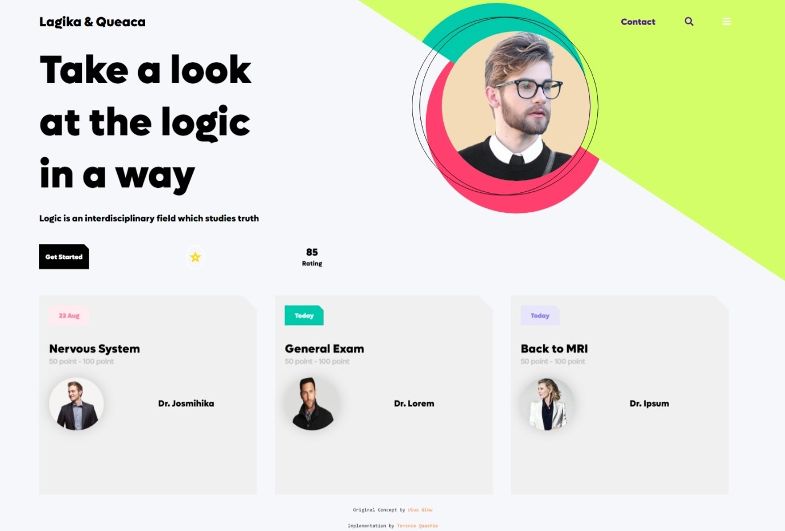
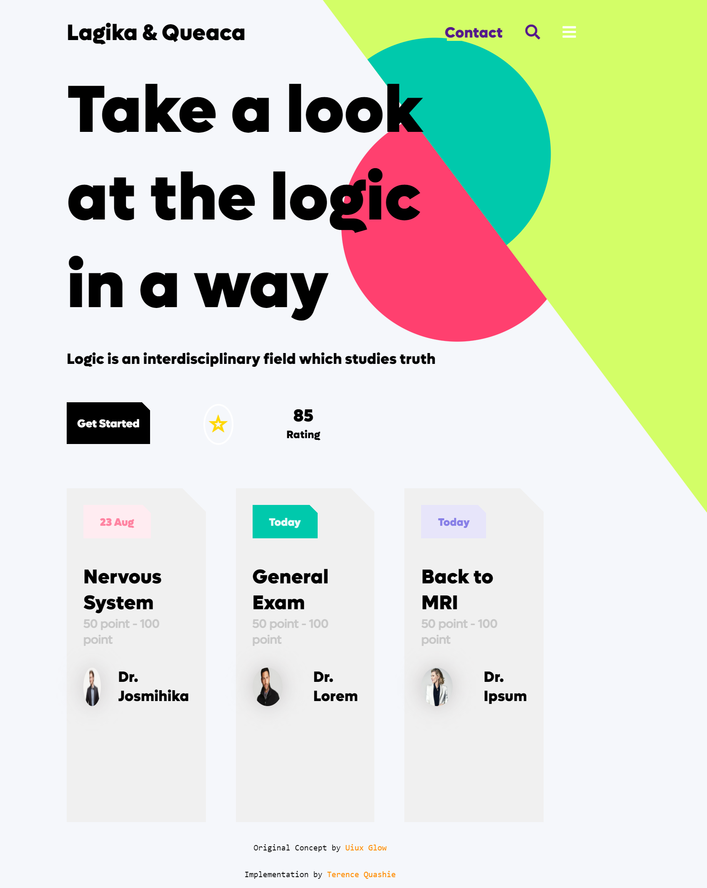
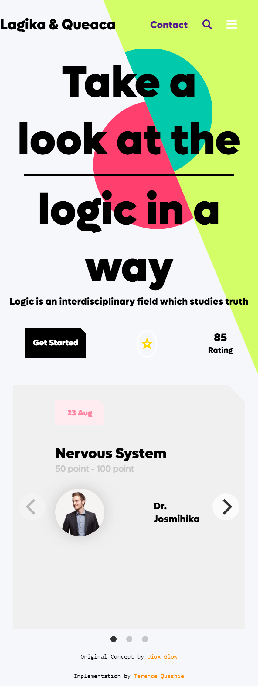

# E-Learning

## Deployment
Check it out here: 
http://e-learning-concept.vercel.app/

## Screenshots

    
    
    

## Attribution
Original Design by [Uiux Glow](https://dribbble.com/shots/17432129/attachments/12561834?mode=media)

## Other Tools Used
- [Flickity](https://flickity.metafizzy.co/) : For the sliders in mobile
- Jquery
- FontAwesome
